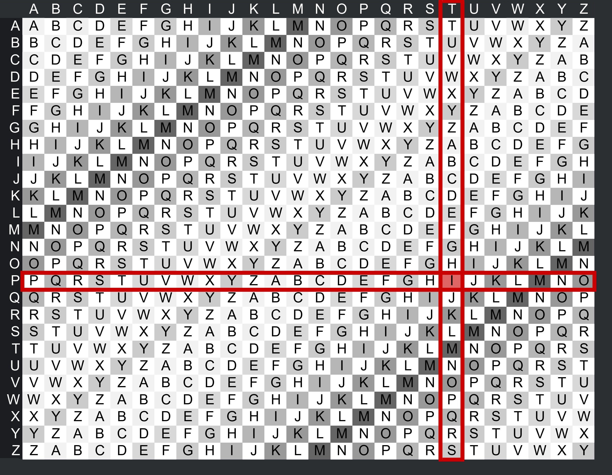

# Vigenère Cipher
In the Vigenère Cipher, a keyword determines the shift for each letter. For the keyword "KEY," the shift changes as you move through the keyword. For "HELLO" with "KEY," the encryption process involves different shifts for each letter.

If we encrypt "thisissampletext" with key "python"

It will go as
```
T H I S I S S A M P L E T E X T
+ + + + + + + + + + + + + + + +
P Y T H O N P Y T H O N P Y T H

I F B Z W F H Y F W Z R I C Q A
```
Here 'T' is shifted by 'P', 'H' by 'Y' and so on...

So, the encrypted text will be "ifbzwfhyfwzricqa"





# Code
```py
def vigenere_encrypt(text,key):
    alphabets = ['a', 'b', 'c', 'd', 'e', 'f', 'g', 'h', 'i', 'j', 'k', 'l', 'm', 'n', 'o', 'p', 'q', 'r', 's', 't', 'u', 'v', 'w', 'x', 'y', 'z']
    text = list(i for i in text.lower() if i in alphabets)
    for i in range(0,len(text)):
        text[i]=alphabets[(alphabets.index(text[i])+alphabets.index(key[i%len(key)]))%26] # shifts the alphabet using the key value 
        # key[i%len(key)] repeates the key for i values (like "pythonpythonpyth") then we get the index of alphabet in key and add it to original text to shift the alphabet
    text = ''.join(text)
    return text

print(vigenere_encrypt('thisissampletext','python'))
```

# Problems
Yeah it looks cool but... It actually is'nt :/

Still very easy to decrypt using technique called frequency analysis, discussed later.

