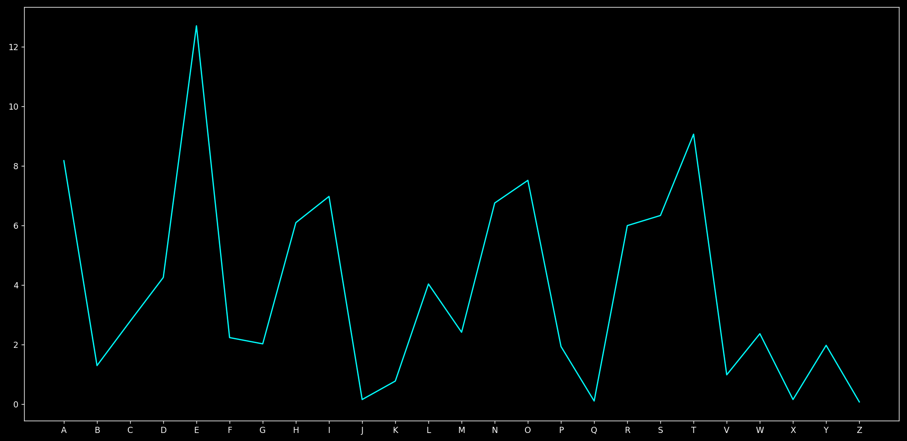

# What is Frequency Analysis?
Frequency analysis is a technique used in cryptography to break ciphers, particularly classical ones like the Caesar cipher or substitution ciphers. It relies on the fact that in any given language, certain letters or combinations of letters appear with predictable frequencies.

Frequency analysis is a technique used in cryptography to break ciphers, particularly classical ones like the Caesar cipher or substitution ciphers. It relies on the fact that in any given language, certain letters or combinations of letters appear with predictable frequencies.

In languages like english, the formation of words or the likeliness of a word to appear causes certain alphabets to appear more, we will use this charachetistic to predict the encrypted text...

```py
# This is the frequency of english alphabets on the basis of how likely they appear
frequency = {
        'E': 12.70, 'T': 9.06, 'A': 8.17, 'O': 7.51, 'I': 6.97, 'N': 6.75,
        'S': 6.33, 'H': 6.09, 'R': 5.99, 'D': 4.25, 'L': 4.03, 'C': 2.78,
        'U': 2.76, 'M': 2.41, 'W': 2.36, 'F': 2.23, 'G': 2.02, 'Y': 1.97,
        'P': 1.93, 'B': 1.29, 'V': 0.98, 'K': 0.77, 'J': 0.15, 'X': 0.15,
        'Q': 0.10, 'Z': 0.07}
```




# Limitations
Patterns only tend to appear in large text as ofcourse you can't get enough data about the frequency from a few sentenses.
It makes breaking cipher texts difficult and sometimes inaccurate.

**Because of these reasons we will use large text files for breaking the encryptions**

### Files used
[Sherlock.txt](../files/sherlock.txt) - A novel from the series "Sherlock Homes".

[text.txt](../files/text.txt) - A random english text with similar frequency but randomised order.
