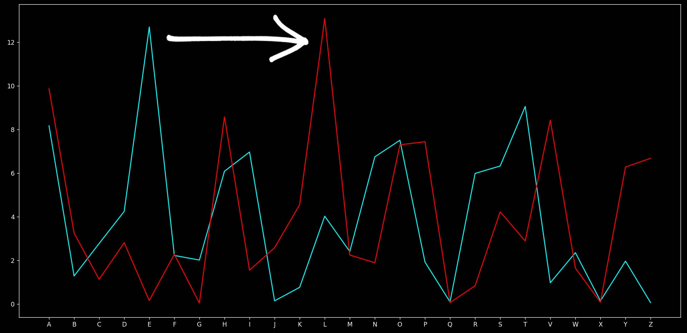

Breaking Ceaser Cipher is quite easy and accurate as there are only 25 possibilities as all the text is shifted by same value between 1-25.

We will analyse the frequency and then store that. Then we will be mapping the new frequency with original frequency given in [2.Frequency-analysis.md](2.Frequency-analysis.md)

# Code
```py
from collections import Counter
import statistics

freqarr=['E', 'T', 'A', 'O', 'I', 'N', 'S', 'H', 'R', 'D', 'L', 'C', 'U', 'M', 'W', 'F', 'G', 'Y', 'P', 'B', 'V', 'K', 'J', 'X', 'Q', 'Z'] # decreasing order of frequency
alpha = ["A","B","C","D","E","F","G","H","I","J","K","L","M","N","O","P","Q","R","S","T","U","V","W","X","Y","Z"]

with open('../files/sherlock-encry-ceaser.txt', 'r', encoding='utf-8') as f:
    text = f.read() # reading encrypted version of sherlock.txt encrypted with shift of 7

encrfreq = Counter(text.upper())
encrfreq = {k: v for k, v in encrfreq.items() if k in alpha} # filtering out alphabets
encrfreq = sorted(encrfreq.items(), key=lambda item: item[1], reverse=True) # noting frequencies of the alphabets in encrypted text

n=0
shiftcount=[]
for i in encrfreq:
    shiftcount.append((alpha.index(i[0])-alpha.index(freqarr[n]))%26) # storing shift values for all alphabets
    n+=1 
shift = statistics.mode(shiftcount) # taking mode of the shift value to filter out best value
print(shift) # get the value by which text was shifted
```

# Graphical Representation

cyan - original frequency graph

red - frequency graph of [sherlock-encry-ceaser.txt](../files/sherlock-encry-ceaser.txt)

**Applying Ceaser Cipher just shifts the graph by shift value (in this case, 7)**