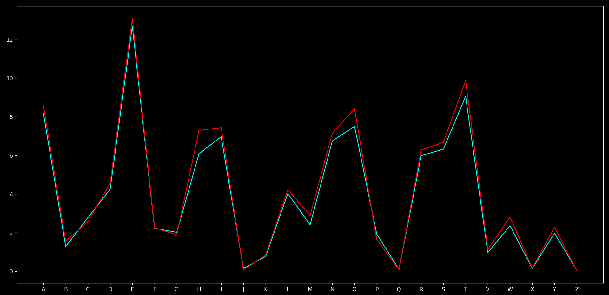

Breaking Monoalphabetic Cipher is not much different from ceaser cipher, but as there is no particular pattern of shift it will be much difficult to predict and, sometimes inaccute.

We wil be using [sherlock-encry-mono.txt](../files/sherlock-encry-mono.txt) which is encrypted from sherlock.txt using the key "qwertyuiopasdfghjklzxcvbnm"

# Code
```py
from collections import Counter

freqarr=['E', 'T', 'A', 'O', 'I', 'N', 'S', 'H', 'R', 'D', 'L', 'C', 'U', 'M', 'W', 'F', 'G', 'Y', 'P', 'B', 'V', 'K', 'J', 'X', 'Q', 'Z'] # decreasing order of frequency
alpha = ["A","B","C","D","E","F","G","H","I","J","K","L","M","N","O","P","Q","R","S","T","U","V","W","X","Y","Z"]

with open('ques/60/sherlock-encry-mono.txt', 'r', encoding='utf-8') as f:
    text = f.read() # reading encrypted version of sherlock.txt encrypted with shift of 7

encrfreq = Counter(text.upper())
encrfreq = {k: v for k, v in encrfreq.items() if k in alpha} # filtering out alphabets
encrfreq = sorted(encrfreq.items(), key=lambda item: item[1], reverse=True) # noting frequencies of the alphabets in encrypted text

mapping = {}
for i in range(0,len(encrfreq)):
    cipher = encrfreq[i][0]
    plain = freqarr[i]
    mapping[cipher] = plain
print(mapping) # mapping the alphabets according to frequencies of alphabets present in encrypted file

key = 'QWERTYUIOPASDFGHJKLZXCVBNM' # key used for encryption
n=0
for i in mapping.keys():
    print(mapping[i] + '=' + alpha[key.index(i)].upper())
    if i == key[alpha.index(mapping[i])]:
        n+=1
print(n) # checking how many alphabets were guessed correctly using the original key
 ```
If we run this code we will only guess 13 alphabets correctly because this sample space is not big enough to properly show frequency.

Fact : Even if we guessed half of the alphabets correctly, those alphabets constitute to about 63.72% of text!!


Original frequency graph (cyan) vs frequency graph of sherlock.txt (red). There is slight deviation in some values because of that, we are getting low accuracy.

This deviation might be also be caused due to writing style of the author as some people might prefer using particular words more than other.
There are many factors we study on...


**If we run the same test on encrypted version of text.txt we will get 100% accuracy as that file correctly represents the frequency distribution.**

You can try it by yourself...

