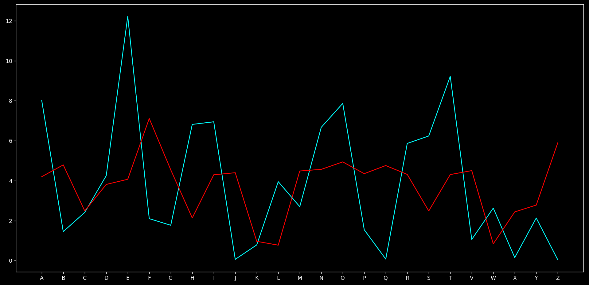

Breaking vigenere cipher is somewhat different from breaking other two ciphers discussed earlier, as it has key of different lengths, that caused certain alphabets to be divided into multiple alphabets.

For example, if we use the key "mnbv" on a text, let's assume 'e' appears multiple times, so, it can be shifted by different values depending on where it falls
```
E + M = Q
E + N = R
E + B = F
E + V = Z
```
This not only changes the order of frequency (like in other two ciphers discussed, only the order of frequencies changes but values remain same) but in case of Vigenere Cipher also the value changes.

Original frequency of [sherlock.txt](../files/sherlock.txt) (cyan) vs after encrypting it through the key "mnbv" (red).

The whole distribution changes...

# Then How?
If we observe closely...
```
T H I S  I S  A  S A M P L E  T E X T  W E  A R E  T R Y I N G  T O  B R E A K  V I G E N E R E  C I P H E R
M N B V  M N  B  V M N B V M  N B V M  N B  V M N  B V M N B V  M N  B V M N B  V M N B V M N B  V M N B V M
```
After every 4 alphabets the alphabet is shifted by using same alphabet, if we divide the sentence into 4 parts on the basis of under which alphabet of key it falls...

**Yesss!!!** We get 4 ceaser ciphers!

Now it can be solved easily, right? well...

# Problem
We saw how it could be solved than whats the problem? huh...

We actually dont know what the length of key is and, it can be anything.

Oh no! Big problem, let's see how we can fix it.

