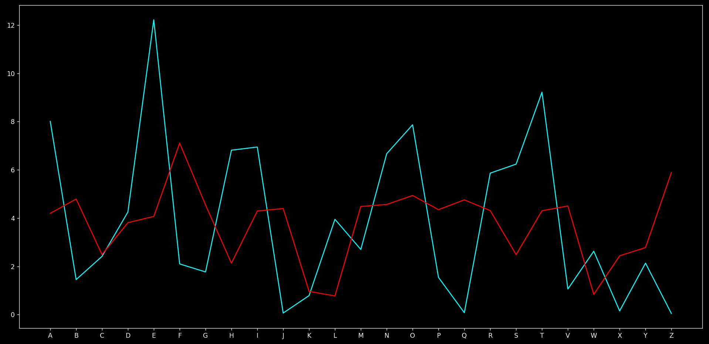
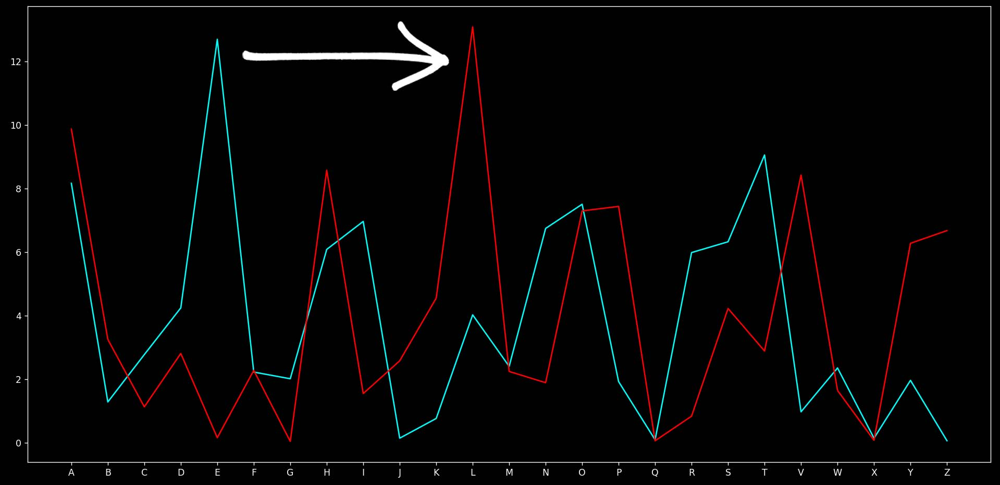

We just saw how collision frequency differs for random text and english text.

What really affects this? Yes, It's the frequencies!

# How can we use it?
We saw when we encrypt using vigenere cipher the frequencies change completely:


But when we use ceaser cipher, just the graph "shifts":


As in ceaser cypher the value of frequencies are retained but the alphabet that corresponds to the value changes, but this will not change the collision probability of the text as we only need values of frequencies.

And we just saw vigenere cipher is just a combination of ceaser ciphers.

When we shift the our sentence by some value which is the multiple of our key length we meet with the alphabet who is encrypted by same key as previous alphabet.

So, It's same as collision probability of ceaser cipher, which comes to be same as english text,

By this method we can record when the value of our collision probability jumps from 0.035 (roughly) to 0.65 (roughly), That will be our key length!

# Code
```py
def collision_probability(file_name,spaces): # function to calculate collision probability
    alphabets = ['a', 'b', 'c', 'd', 'e', 'f', 'g', 'h', 'i', 'j', 'k', 'l', 'm', 'n', 'o', 'p', 'q', 'r', 's', 't', 'u', 'v', 'w', 'x', 'y', 'z']
    with open(file_name, 'r', encoding='utf-8') as f:
        text = f.read()
    text = text.lower()
    text = list(text)
    text = [v for v in text if v in alphabets]
    coll = 0
    for i in range(0,len(text)):
        if text[i]==text[(i+spaces)%len(text)]:
            coll+=1
    return coll/len(text)
    
def cryptanalyse_vigenere_findlength(file):
    for n in range(1,1000):
        if collision_probability(file,n)>0.06:
            return n # breaks the function as soon as the value jumps to more than 0.06
            # here n will be the key length
```

This is how we will find the key length, once we have it we can simply do...
```py
import statistics 
from collections import Counter

def analyse_with_key_length(file,key_length):
    freqarr=['E', 'T', 'A', 'O', 'I', 'N', 'S', 'H', 'R', 'D', 'L', 'C', 'U', 'M', 'W', 'F', 'G', 'Y', 'P', 'B', 'V', 'K', 'J', 'X', 'Q', 'Z']
    alpha = ['A', 'B', 'C', 'D', 'E', 'F', 'G', 'H', 'I', 'J', 'K', 'L', 'M', 'N', 'O', 'P', 'Q', 'R', 'S', 'T', 'U', 'V', 'W', 'X', 'Y', 'Z']

    with open(file, 'r', encoding='utf-8') as f:
        text = f.read()

    key=''
    for num in range(0,key_length): # diving the text in different parts according to the given key length
        spacestring=''
        for i in range(0,len(text)):
            if i%key_length==num: # will only take values at the interval of key length as only then remainder will be same.
                spacestring+=text[i] 
# once it's broken down to intervals its basically a ceaser cipher so we can use the same method for it
        encrfreq = Counter(spacestring.upper())
        encrfreq = {k: v for k, v in encrfreq.items() if k in alpha}
        encrfreq = sorted(encrfreq.items(), key=lambda item: item[1], reverse=True)

        n=0
        shiftcount=[]
        for i in encrfreq:
            shiftcount.append((alpha.index(i[0])-alpha.index(freqarr[n]))%26)
            n+=1
        key += alpha[statistics.mode(shiftcount)] # get alphabet corresponding to the shift value and add it to the key
    return key
``` 

We finally got our key to unlock the text!!!

Now, we can simply decrypt using code in [5.Deciphering.md](../3.Substitution-Cipher/5.Deciphering.md).
